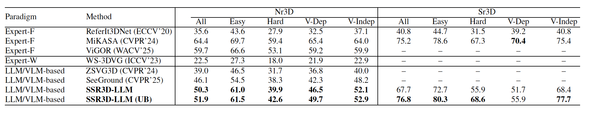

# SSR3D-LLM

This repository is the public release package for SSR3D-LLM.
It currently focuses on runnable evaluation/demo scripts, configs, and docs.

<figure align="center">
  
  <figcaption>
    <strong>Abstract.</strong> 3D object grounding localizes a referred object in a 3D scene from natural language.
    Unified instance-centric 3D-LLMs aim to solve grounding together with dialog, QA, and captioning, yet many rely on a
    single pointer decision that struggles on fine-grained queries involving multiple anchor objects and spatial relations.
    We propose <em>Structured Spatial Reasoning 3D-LLM</em> (SSR3D-LLM), which introduces a supervised intermediate spatial
    state inside a 3D-LLM: the LLM reads the instruction once to construct this state, and a geometry-based module refines
    candidate rankings step by step with simple step-length control. Extensive experiments under consistent protocols show
    that SSR3D-LLM improves fine-grained grounding, surpassing strong baselines by up to 4.2% accuracy on Nr3d while
    largely preserving general language abilities.
  </figcaption>
</figure>

## Framework

<p align="center">
  
</p>

The framework above is the exact method figure used in the paper.
At a high level, SSR3D-LLM keeps the unified 3D-LLM backbone, uses `<geom>` as routing control, and introduces structured
spatial-state conditioned grounding with recursive state updates for fine-grained disambiguation.

## Main Results

<p align="center">
  
</p>

This Table-1 snapshot summarizes the main quantitative outcome: under matched protocol and checkpoints, SSR3D-LLM improves
fine-grained grounding (including the 50.3/51.9 settings) while keeping broad language-task capability competitive.

## Release Scope

- [x] Released: evaluation/inference code and reproduction scripts.
- [x] Released: anonymous-phase minimal assets via external download links in `data/README.md`.
- [ ] TODO: full training code release and full training-data release.

## Anonymous Asset Strategy

To keep the anonymous storage footprint manageable, this release separates assets into three buckets:

- Project-owned assets: hosted by us (single Figshare bundle link in `data/README.md`).
- Third-party assets: downloaded from their official sources (ScanNet/LLM/BERT).
- Visual frontend caches: `MASK3D_FEATS_*` are included in the same Figshare bundle as zipped assets; local regeneration is optional via `scripts/run_export_mask3d_features.sh`.

Anonymous review bundle link (project-owned assets):
`https://figshare.com/s/b4f92c34ceda0b17626d`

## Repository Usage

### What Is In This Repo

- `scripts/`: release entry scripts (primarily eval/demo)
- `configs/`: path config templates and environment-specific overrides
- `data/`: placeholder-only asset scaffold (no real datasets/weights committed)
- `tools/`: eval and preprocessing helpers used by release scripts
- `docs/`: usage and reproduction docs for this release package
- `baseline/`: hydra-free baseline pipeline used by release scripts
- `main_run.py`: unified Python launcher (`--entry standard|interface`)

### Quick Start

#### 1) Configure local paths

```bash
cd <repo-root>
cp configs/paths.example.sh configs/paths.sh
# edit configs/paths.sh
bash scripts/check_paths.sh
```

#### 2) Run official eval/demo entrypoints

```bash
# Appendix-style capability examples (baseline vs ours)
bash scripts/run_eval_appendix_examples.sh

# One-click dialog demo from packed ckpt
bash scripts/run_eval_dialog_demo.sh
```

#### 3) (Optional fallback) Regenerate visual frontend caches locally

The Figshare bundle already provides zipped `MASK3D_FEATS_*`.
If you cannot use those zip files in your environment, generate them locally:

```bash
# validation / test side features
bash scripts/run_export_mask3d_features.sh validation

# train side features (for ReferIt3D suite requiring train feature root)
bash scripts/run_export_mask3d_features.sh train
```

### Data Policy

This repo does not ship datasets or model weights.
Use the placeholder structure under `data/` and fill assets locally.

- Asset registry template: `data/README.md`
- Data setup guide: `docs/data.md`

### Common Entry Scripts

- `scripts/run_eval_appendix_examples.sh`: paper-protocol style qualitative eval
- `scripts/run_eval_dialog_demo.sh`: one-click dialog demo from packed ckpt
- `scripts/run_eval_unified.sh`: unified entry for repro/ask workflows
- `scripts/run_eval_stepslot_varlen.sh`: evaluate varlen one-pass chain
- `scripts/run_eval_referit3d_suite.sh`: evaluate ReferIt3D suite
- `scripts/run_export_mask3d_features.sh`: export `MASK3D_FEATS_*` from a Step-2 ckpt

### Docs Index

- `docs/data.md`: data/checkpoint preparation for this release
- `docs/release_checklist.md`: final release checklist
- `docs/release_notes.md`: release scope and notes
- `docs/scripts.md`: human-friendly script entrypoints (`run_*.sh`) and legacy mapping
- `docs/ssr3dllm_pipeline.md`: pipeline overview and knobs

### Runtime Notes

- SPICE/Java reflective-access warnings can appear during caption metrics; this is expected.
- Some checks/scripts will skip steps when required assets are missing.

### Maintainer-Only

- Use `docs/release_checklist.md` for pre-release checks.
