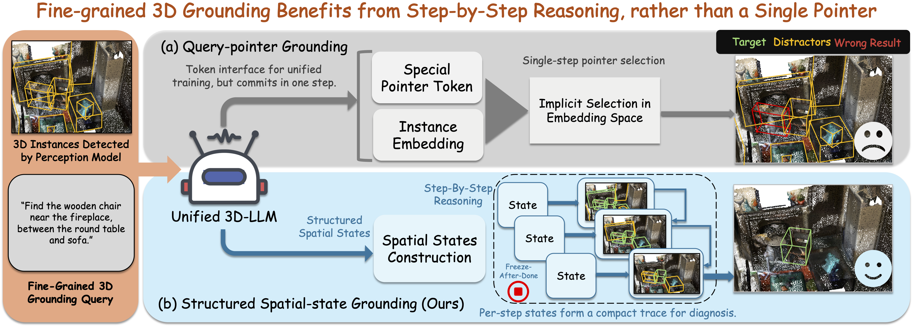
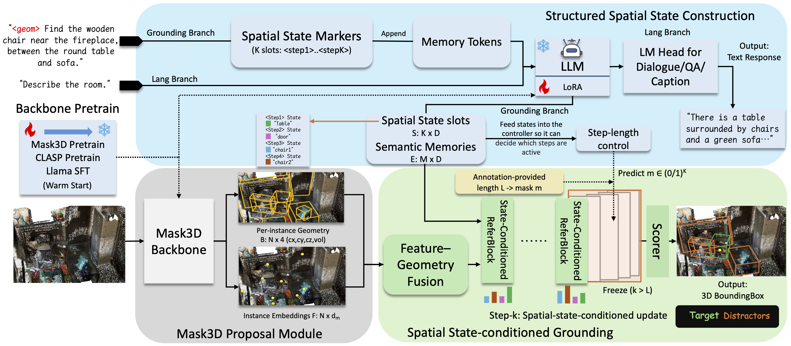
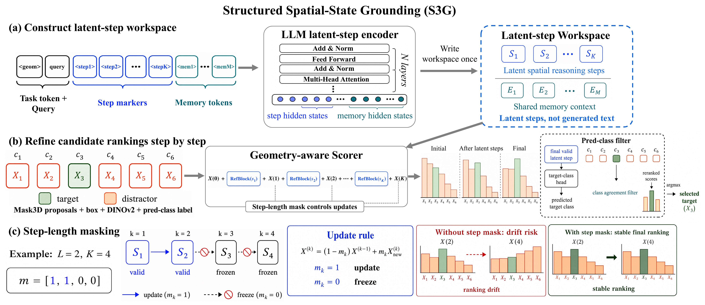

# SSR3D-LLM

**SSR3D-LLM: Structured Spatial Reasoning via Latent Steps for Fine-Grained Grounding in Unified 3D-LLMs**

This repository is the anonymous release package for SSR3D-LLM.
It provides runnable evaluation/demo scripts, release configs, documentation, and asset pointers for reproducing the paper's main evaluation workflows.

<figure align="center">
  
  <figcaption>
    <strong>Figure 1: QPG vs. S3G.</strong>
    Fine-grained 3D grounding often requires ruling out candidates through context objects and spatial relations.
    Query-Pointer Grounding (QPG) makes one pointer-style selection, while S3G writes latent spatial reasoning steps and refines candidate rankings step by step.
  </figcaption>
</figure>

## Abstract

3D object grounding localizes referred objects in a 3D scene from natural language.
Unified instance-centric 3D-LLMs aim to solve grounding together with dialog, QA, and captioning, yet many rely on a single pointer-style grounding decision that compresses a relational instruction into one selection.
This is brittle for fine-grained queries where multiple same-class candidates must be ruled out by context objects and spatial relations.

We propose **Structured Spatial Reasoning 3D-LLM (SSR3D-LLM)**, a structured grounding interface for unified 3D-LLMs.
Given fixed Mask3D object proposals, the LLM writes a sequence of latent spatial reasoning steps and memory tokens from the query, and a geometry-aware scorer reads these latent steps in order to refine candidate rankings step by step with step-length masking.
The latent steps are learned from standard benchmark target supervision with auxiliary referential-cue supervision during training, while inference uses only the input query and Mask3D proposals.
Across ReferIt3D, ScanRefer, and Multi3DRef, SSR3D-LLM achieves the strongest results among unified 3D-LLM baselines, with substantial gains over the single-pointer QPG baseline on fine-grained grounding and consistent improvements over prior unified 3D-LLMs, while preserving the default language-task route.

## Method Overview

<p align="center">
  
</p>

SSR3D-LLM keeps the unified 3D-LLM backbone and the Mask3D-based candidate pipeline, but replaces the single QPG pointer with a structured grounding route.
Without `<geom>`, the model follows the default dialog/QA/caption pathway.
With `<geom>`, it routes the instruction and Mask3D proposal representations to S3G for target selection and step-wise score traces.

The candidate representation is built on fixed Mask3D proposal rows.
Rotated-box geometry, optional DINOv2 multi-view appearance, and proposal-side predicted-class labels are proposal-level representation enhancements, not new proposal generation.

## S3G Mechanism

<p align="center">
  
</p>

S3G has three parts:

1. **Latent-step workspace.** Reserved step markers and memory tokens let the LLM write latent spatial reasoning steps from the query in one forward pass.
2. **Geometry-aware scoring.** A scorer reads the latent steps and recursively refines candidate rankings over the fixed Mask3D proposal set.
3. **Step-length masking and pred-class filtering.** Step-length masking freezes updates after the effective steps are complete; the pred-class filter uses the model-predicted target class as a final reranking signal.

The latent steps are not generated text traces.
They are hidden representations used by the grounding readout, so inference does not require manually annotated referential order.

## Main Results

The paper reports specialized, reasoning-centric, and vision-LLM systems for broader context.
The most direct comparison is the **Unified 3D-LLMs** block, where methods preserve a general 3D-LLM while adding grounding.

### ReferIt3D / Nr3D

Official ReferIt3D candidate-set Top-1 accuracy on Nr3D:

| Method | Backbone | FT | All | Easy | Hard | V-Dep. | V-Ind. |
|---|---|---:|---:|---:|---:|---:|---:|
| Chat-Scene (NeurIPS'24) | Vicuna-7B | yes | 25.9 | 31.0 | 21.4 | 21.6 | 28.3 |
| Grounded 3D-LLM (arXiv'24) | Tiny-Vicuna-1B | yes | 32.8 | 40.3 | 25.5 | 29.7 | 34.3 |
| **SSR3D-LLM** | Tiny-Vicuna-1B | yes | **50.3** | **61.0** | **39.9** | **46.5** | **52.1** |

Grounded 3D-LLM uses a QPG interface under the same proposal-level representation protocol.
Chat-Scene is included as a supplementary unified 3D-LLM reference with related proposal-level visual evidence but a different backbone, object-token construction, output interface, and training adaptation.

### ScanRefer and Multi3DRef

ScanRefer reports Acc@0.25IoU / Acc@0.50IoU.
Multi3DRef reports F1@0.25IoU / F1@0.50IoU.

| Method | Backbone | FT | ScanRefer A@0.25 | ScanRefer A@0.50 | Multi3DRef F1@0.25 | Multi3DRef F1@0.50 |
|---|---|---:|---:|---:|---:|---:|
| Chat-Scene (NeurIPS'24) | Vicuna-7B | yes | 55.5 | 50.2 | 57.1 | 52.4 |
| Grounded 3D-LLM (arXiv'24) | Tiny-Vicuna-1B | yes | 48.6 | 44.0 | 44.7 | 40.8 |
| **SSR3D-LLM** | Tiny-Vicuna-1B | yes | **58.7** | **53.9** | **63.1** | **57.9** |

These results show that SSR3D-LLM improves over prior unified 3D-LLM baselines across fine-grained candidate selection, box localization, and set-level grounding.

### Grounding Readout Runtime

All rows use precomputed proposal-level inputs and measure only the grounding readout from object/query representations to the final prediction.
Timing excludes Mask3D proposal extraction, DINOv2 feature generation, query-side preprocessing, and data loading.
Chat-Scene is a broader unified-3D-LLM reference rather than a same-protocol runtime baseline.

| Dataset | Method | Latency (s/query) | Throughput (query/s) | Peak Mem. (GB) |
|---|---|---:|---:|---:|
| Nr3D | Grounded 3D-LLM | 1.1610 | 0.861 | 3.159 |
| Nr3D | Chat-Scene | 1.0787 | 0.927 | 19.741 |
| Nr3D | **SSR3D-LLM** | **0.0363** | **27.585** | 5.792 |
| ScanRefer | Grounded 3D-LLM | 0.9882 | 1.012 | 3.192 |
| ScanRefer | Chat-Scene | 1.4412 | 0.694 | 19.740 |
| ScanRefer | **SSR3D-LLM** | **0.0388** | **25.765** | 5.795 |
| Multi3DRef | Grounded 3D-LLM | 1.0166 | 0.984 | 3.186 |
| Multi3DRef | Chat-Scene | 1.2532 | 0.798 | 19.674 |
| Multi3DRef | **SSR3D-LLM** | **0.0380** | **26.299** | 5.792 |

## Qualitative Grounding Trace

<p align="center">
  
</p>

A real ScanRefer example shows the query, step-wise candidate scores, proposal boxes, and baseline vs. SSR3D-LLM predictions.
The qualitative trace illustrates how S3G separates competing same-class candidates through context objects and spatial relations before the final target selection.

## Release Scope

- Released: evaluation/inference code and paper reproduction scripts for the anonymous review package.
- Released: S3G modules, configs, evaluation mappings, feature-export utilities, and demo entrypoints.
- Released: anonymous-phase project-owned assets through the external bundle listed in `data/README.md`.
- Not committed to git: raw datasets, base LLM/BERT weights, and large checkpoints.
- Third-party datasets and pretrained models should be obtained from their official sources and used under their own licenses/terms.

Anonymous review bundle link for project-owned assets:

```text
https://figshare.com/s/b4f92c34ceda0b17626d
```

## Repository Usage

### What Is In This Repo

- `scripts/`: release entry scripts for evaluation, demos, paper-metric reproduction, and feature export
- `configs/`: path config templates
- `data/`: placeholder-only asset scaffold; real datasets/weights are not committed
- `tools/`: evaluation, checkpoint-adaptation, visualization, and preprocessing helpers
- `docs/`: usage and reproduction docs for this release package
- `baseline/`: hydra-free Grounded 3D-LLM baseline pipeline used by release scripts
- `models/`, `train/`, `utils/`: SSR3D-LLM modules and training/evaluation entry code
- `main_run.py`: unified Python launcher (`--entry standard|interface`)

### Quick Start

#### 1) Configure local paths

```bash
cd <repo-root>
cp configs/paths.example.sh configs/paths.sh
# edit configs/paths.sh for your local asset paths
bash scripts/check_paths.sh
```

#### 2) Run official eval/demo entrypoints

```bash
# Appendix-style capability examples: baseline vs. SSR3D-LLM
bash scripts/run_eval_appendix_examples.sh

# One-click dialog demo from packed checkpoint
bash scripts/run_eval_dialog_demo.sh

# ReferIt3D suite
bash scripts/run_eval_referit3d_suite.sh

# ScanRefer / Multi3DRef grounding metrics
bash scripts/run_eval_scanrefer_multi3dref.sh

# SSR3D-LLM grounding-readout throughput
bash scripts/run_benchmark_readout.sh
```

Set `SCANREFER_DINO_SAMPLE_CACHE_ROOT` or `MULTI3DREF_DINO_SAMPLE_CACHE_ROOT` in `configs/paths.sh` to enable optional DINO appearance fusion during ScanRefer/Multi3DRef evaluation.

#### 3) Optional: regenerate proposal-level visual features

The external asset bundle already provides zipped `MASK3D_FEATS_*`.
If you cannot use those zip files in your environment, generate them locally:

```bash
# validation / test side features
bash scripts/run_export_mask3d_features.sh validation

# train side features
bash scripts/run_export_mask3d_features.sh train
```

#### 4) Optional: regenerate DINO appearance sidecar features

The DINO appearance sidecar caches are not included in the anonymous Figshare bundle because the bundle has a 20GB storage limit. They can be regenerated from ScanNet RGB-D frames and the same Mask3D proposal cache used by the evaluation CSVs.

The released evaluator expects one DINO sidecar `.pt` per query sample. Each CSV row should contain `mask3d_sample_cache_relpath` or `mask3d_sample_cache_path`, and the DINO sidecar root should mirror those relative paths. Each sidecar file must be a PyTorch dictionary with:

```text
proposal_dino_features: FloatTensor [num_proposals, 1024]
proposal_dino_valid_mask: BoolTensor [num_proposals]
gt_to_query_map: dict mapping ScanNet object id to proposal row
```

To reproduce the DINO cache locally:

```bash
export DATASET=scanrefer
export SCANREFER_QCOND_CACHE_ROOT=/path/to/scanrefer_query_conditioned_mask3d_cache
export SCANREFER_DINO_SAMPLE_CACHE_ROOT=/path/to/scanrefer_dino_sidecars
export DINO_SOURCE_FEATURES=/path/to/scannet_dinov2_multiview_object_features.pt
export DINO_SOURCE_ATTRIBUTES=/path/to/scannet_mask3d_object_attributes.pt
bash scripts/run_build_dino_sidecar_cache.sh
```

For Multi3DRef, set `DATASET=multi3dref`, `MULTI3DREF_QCOND_CACHE_ROOT`, and `MULTI3DREF_DINO_SAMPLE_CACHE_ROOT`. `DINO_SOURCE_FEATURES` and `DINO_SOURCE_ATTRIBUTES` may contain multiple `:`-separated files if the source features are sharded.

`DINO_SOURCE_FEATURES` is a PyTorch dictionary of multi-view DINOv2 object features keyed as `scene_id_objectid`, for example `scene0000_00_03`. `DINO_SOURCE_ATTRIBUTES` is a PyTorch dictionary keyed by `scene_id`; each value should contain `locs` as `[num_objects, 6]` center-size boxes and optionally `obj_ids`.

After the sidecar cache is built, set:

```bash
export SCANREFER_DINO_SAMPLE_CACHE_ROOT=/path/to/scanrefer_dino_sidecars
export MULTI3DREF_DINO_SAMPLE_CACHE_ROOT=/path/to/multi3dref_dino_sidecars
export DINO_FEATURE_DIM=1024
export DINO_ALPHA=2.0
```

If these paths are unset, the released scripts run without DINO appearance fusion.

## Data Policy

This repo does not ship raw datasets or base model weights.
Use the placeholder structure under `data/` and fill assets locally.

- Asset registry template: `data/README.md`
- Data setup guide: `docs/data.md`

## Common Entry Scripts

- `scripts/run_eval_appendix_examples.sh`: paper-protocol qualitative/capability examples
- `scripts/run_eval_dialog_demo.sh`: one-click dialog demo from packed checkpoint
- `scripts/run_eval_unified.sh`: unified entry for reproduction and ask-mode workflows
- `scripts/run_eval_stepslot_varlen.sh`: latent-step variable-length evaluation helper
- `scripts/run_eval_referit3d_suite.sh`: ReferIt3D evaluation suite
- `scripts/run_eval_scanrefer_multi3dref.sh`: ScanRefer and Multi3DRef SSR3D-LLM metric evaluation
- `scripts/run_benchmark_readout.sh`: SSR3D-LLM grounding-readout throughput benchmark
- `scripts/run_export_mask3d_features.sh`: export proposal-level Mask3D features from a Step-2 checkpoint

## Docs Index

- `docs/data.md`: data/checkpoint preparation for this release
- `docs/release_checklist.md`: maintainer release checklist
- `docs/release_notes.md`: release scope and notes
- `docs/scripts.md`: human-friendly script entrypoints and legacy mapping
- `docs/ssr3dllm_pipeline.md`: pipeline overview and knobs

## Runtime Notes

- Runtime numbers above are readout-only measurements after proposal-level inputs have been prepared.
- SPICE/Java reflective-access warnings can appear during caption metrics; this is expected.
- Some checks/scripts skip steps when required assets are missing.
