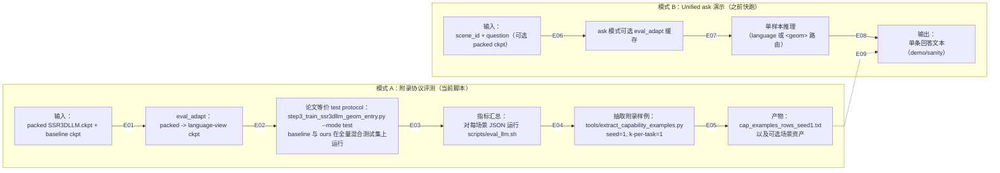

```mermaid
%%{init: {'flowchart': {'nodeSpacing': 54, 'rankSpacing': 62, 'curve': 'linear'}, 'themeVariables': {'edgeLabelBackground': '#ffffff', 'edgeLabelTextColor': '#111827'}}}%%
flowchart LR

subgraph A["模式 A：附录协议评测（当前脚本）"]
  direction TB
  A0["输入：<br/>packed SSR3DLLM.ckpt + baseline ckpt"]
  A1["eval_adapt：<br/>packed -> language-view ckpt"]
  A2["论文等价 test protocol：<br/>step3_train_ssr3dllm_geom_entry.py --mode test<br/>baseline 与 ours 在全量混合测试集上运行"]
  A3["指标汇总：<br/>对每场景 JSON 运行 scripts/eval_llm.sh"]
  A4["抽取附录样例：<br/>tools/extract_capability_examples.py<br/>seed=1, k-per-task=1"]
  A5["产物：<br/>cap_examples_rows_seed1.txt<br/>以及可选场景资产"]
  A0 -->|E01| A1
  A1 -->|E02| A2
  A2 -->|E03| A3
  A3 -->|E04| A4
  A4 -->|E05| A5
end

subgraph B["模式 B：Unified ask 演示（之前快跑）"]
  direction TB
  B0["输入：<br/>scene_id + question（可选 packed ckpt）"]
  B1["ask 模式可选 eval_adapt 缓存"]
  B2["单样本推理<br/>（language 或 &lt;geom&gt; 路由）"]
  B3["输出：<br/>单条回答文本（demo/sanity）"]
  B0 -->|E06| B1
  B1 -->|E07| B2
  B2 -->|E08| B3
end

A5 -.->|E09| B3
```

### 边注释（E##）

- **E01-E05**：当前附录脚本是完整协议流水线，不是单次前向。
- **E06-E08**：之前 ask 模式是单样本交互推理，定位是 demo。
- **E09**：ask 可用于风格 sanity check，但不能替代附录协议产物。

